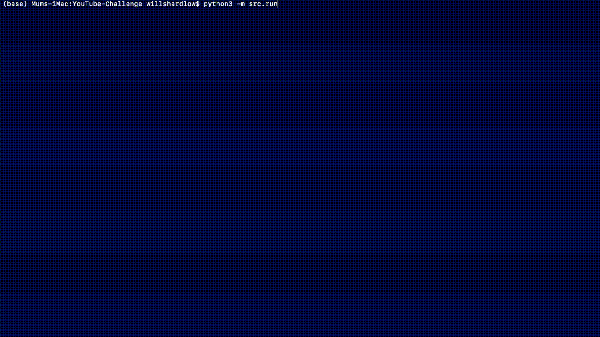

# YouTube-Challenge

A coding challenge set by Google as part of the Bright Network Internship Experience. Producing a command line application to simulate YouTube.

The challenge and provided code template can be found [here](https://github.com/internship-experience-uk/google-code-sample.git).

## Running the command line application

To run the command line application:

```shell script
python3 -m src.run
```

To see a list of all available commands, type `HELP` as a command. To exit the application, type `EXIT`.

I recommend starting with `SHOW_ALL_VIDEOS` to see all available videos in the library, along with their tags and IDs.

You can then try out the various features such as playing videos and creating playlists.

## Demo


